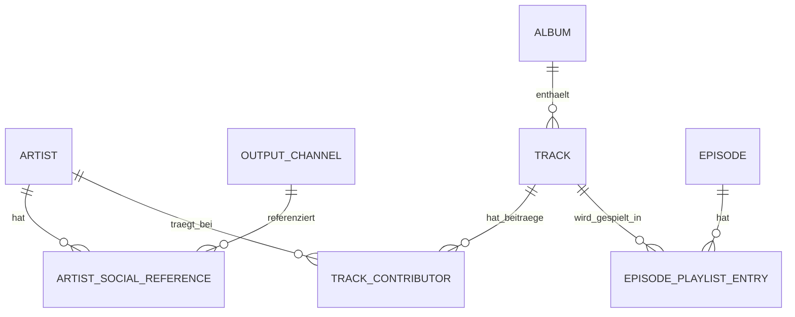

# Projektkonzept: SetLister

**Status:** Anforderungsanalyse abgeschlossen, Datenmodell und Architektur festgelegt. Bereit für Umsetzungsplanung.
**Version:** 2.1 (Projektname ergänzt)

## Titel
SetLister – Podcast Sendungsverwaltung (bewusst ohne Bezug zum konkreten Podcast, da Open-Source-Veröffentlichung auf GitHub geplant ist)

## Projekttyp
Standalone-Anwendung, **lokal betrieben** (kein Online-Dienst). Keine direkte Einbindung in eine CMS-/Podcast-Website als Anforderung – erzeugte Ausgaben (HTML-/Textfragmente) werden manuell in die Zielsysteme (z. B. bestehende Joomla-Website, Social-Media-Kanäle) übernommen.

## Kurzbeschreibung

Die Anwendung realisiert eine Sendungsverwaltung für einen Podcast. Kernfunktion ist die Pflege von Episoden mit ihrer Playlist (Abfolge gespielter Tracks) sowie der zugehörigen Stammdaten zu Künstlern, Alben und Tracks. Aus einer Episoden-Playlist lassen sich automatisiert HTML- und Text-Ausgabefragmente für Website und Social Media erzeugen.

Die Datenpflege erfolgt lokal (netzunabhängig), z. B. über eine per Docker bereitgestellte Browser-Oberfläche auf `localhost`.

---

## 1. Funktionale Anforderungen

### 1.1 Episodenverwaltung

Eine Episode (Podcast-Folge) besitzt:
- Ausgabennummer
- Schlagzeile
- Thema
- Sendedatum (optional/nullable)

Der Veröffentlichungsstatus ist kein eigenes Feld, sondern wird abgeleitet: Sendedatum nicht gesetzt = Entwurf, Sendedatum gesetzt = veröffentlicht.

Jede Episode besitzt genau eine Playlist.

### 1.2 Playlistverwaltung

Eine Playlist ist eine manuell sortierbare, geordnete Liste von Track-Referenzen – **kein eigener Eintragstyp**. Jeder Listenplatz referenziert direkt einen Stammdaten-Track; Künstler und Album ergeben sich daraus automatisch (siehe 1.6).

- Reihenfolge = tatsächliche Sendereihenfolge im Podcast
- Sortierung erfolgt manuell (z. B. per Drag & Drop) durch die Redaktion
- Ein Track kann in mehreren Episoden vorkommen (Wiederholungen möglich)

### 1.3 Ausgabekanäle

Ein Ausgabekanal ist eine selbst pflegbare Entität, kein Festschema im Code, mit:
- Name (Pflicht, eindeutig, z. B. "Facebook", "Mastodon")
- Ausgabe-Muster (Pflicht): ein Text-Template mit Platzhaltern `{artists}`, `{track}`, `{album}` für die Textfragment-Ausgabe (siehe 1.8), z. B. `{artists} ({album})` oder `{artists}`

Das ersetzt ein früher fest im Code hinterlegtes 4-Kanal-Schema (Facebook/Instagram/Threads/Bluesky) durch eine in der Oberfläche verwaltbare Liste – neue Kanäle (z. B. Mastodon) erfordern keine Codeänderung mehr. Das HTML-Fragment (1.7) bleibt davon unabhängig fest formatiert.

### 1.4 Künstlerverwaltung

Eintrag pro Künstler mit:
- Künstlername (Pflicht)
- Realname (optional)
- Website-URL (optional)
- Referenznamen je Ausgabekanal (optional), als Auswahl aus der in 1.3 gepflegten Kanalliste (nicht als Freitext)

Hat ein Künstler für einen Ausgabekanal keinen Referenznamen hinterlegt, wird dort ersatzweise der Künstlername verwendet.

### 1.5 Albumverwaltung

Eintrag je Album mit:
- Albumtitel (Pflicht)
- Albumlink (optional)

Alben besitzen **keine eigene Künstlerzuordnung** und keine weiteren Metadaten. Welche Tracks zu einem Album gehören, ergibt sich ausschließlich über die Track→Album-Referenz; ein Sonderfall "Diverse/Various" (z. B. für Sampler) ist dadurch nicht erforderlich.

### 1.6 Trackverwaltung

Eintrag je Track mit:
- Tracktitel (Pflicht)
- Albumreferenz (Pflicht, über Datensatz-ID – **nicht** über den Titel, da Tracktitel nicht eindeutig sind)
- Künstlerzuordnung(en): ein oder mehrere Künstler, jeweils mit einer **Rolle** und einer Reihenfolgeposition:
  - **Original** – (Mit-)Urheber des Tracks
  - **Feat.** – als Feature beitragender Künstler
  - **Remix** – Künstler einer Remix-/Variantenversion

Die Rollen bestimmen die Ausgabeformatierung des/der Künstler (siehe 1.8).

### 1.7 Dynamische Ausgabe von HTML-Fragmenten

Für eine Episoden-Playlist kann ein HTML-Fragment erzeugt werden, bestehend aus einer Liste je Track:

```
<Künstler°> - <Track> (<Album>)
```

- Jeder Künstlername ist einzeln mit seinem Künstlerlink verlinkt (falls vorhanden)
- Der Albumtitel ist mit dem Albumlink verlinkt (falls vorhanden)
- Ausgabe als kopierbares HTML-Snippet (kein automatisches Publizieren in ein CMS)

### 1.8 Dynamische Ausgabe von Textfragmenten (Ausgabekanäle)

Für eine Playlist wird je in 1.3 gepflegtem Ausgabekanal ein Textfragment erzeugt: Das Kanal-Muster wird pro Track-Eintrag mit `{artists}`/`{track}`/`{album}` gefüllt, die Einträge werden mit `, ` verbunden. Die mitgelieferten Standardkanäle bilden die ursprünglich fest vorgesehenen Formate ab:

- Facebook / Instagram (Muster `{artists} ({album})`): `<Künstler°> (<Album>), <Künstler°> (<Album>), ...`
- Threads / Bluesky (Muster `{artists}`): `<Künstler°>, <Künstler°>, ...`

Künstlernamen werden dabei durch den kanalspezifischen Referenznamen ersetzt (Fallback: Künstlername, siehe 1.4).

#### Formatierungsregel für `<Künstler°>`

Künstler werden nach Rolle gruppiert und wie folgt zusammengesetzt:

1. **Original-Künstler** werden als Liste verbunden: letzter Name mit `&`, davor mit Komma:
   - 1 Künstler: `A`
   - 2 Künstler: `A & B`
   - 3 Künstler: `A, B & C`
2. **Feature-Künstler** werden der Original-Gruppe angehängt:
   - `A feat. B`
   - `A & B feat. C`
3. **Remix-Künstler** werden per `vs` abgetrennt (Original-/Feat.-Gruppe vs Remix-Gruppe):
   - `A vs B`
   - `A feat. B vs C`

Jeder Einzelname bleibt dabei individuell verlinkt (HTML) bzw. individuell durch seinen Referenznamen ersetzt (Text). Die gleichzeitige Kombination aus Feature *und* Remix auf demselben Track ist im Modell abgedeckt, aber aktuell kein praktisch benötigter Fall.

### 1.9 Setlisten-Gesamtübersicht (umgesetzt)

Zusätzlich zur Pflege einzelner Episoden gibt es unter "Setlisten" eine Gesamtübersicht über alle jemals gespielten Tracks (ein Eintrag je Episoden-Einsatz): Spalten Episode/Künstler/Track/Album, jede Spalte einzeln sortierbar (auf/ab) und mit Freitextfilter (entprellt), alle gepflegten Episoden (auch Entwürfe), paginiert mit einstellbarer Seitengröße (10/50/100/alle), Künstler- und Album-Links soweit hinterlegt. Keine Aggregation je Track. Daten werden einmalig komplett geladen, Filter/Sortierung/Pagination laufen client-seitig.

---

## 2. Datenmodell

### 2.1 Entitäten und Attribute

| Entität | Attribute |
|---|---|
| **Artist** | id, name (Pflicht), realName (optional), websiteUrl (optional) |
| **OutputChannel** | id, name (Pflicht, eindeutig), pattern (Pflicht, Platzhalter `{artists}`/`{track}`/`{album}`) |
| **ArtistSocialReference** | id, artistId (FK), channelId (FK auf OutputChannel), referenceName |
| **Album** | id, title (Pflicht), link (optional) |
| **Track** | id, title (Pflicht), albumId (FK, Pflicht) |
| **TrackContributor** | trackId (FK), artistId (FK), role (`ORIGINAL` \| `FEATURING` \| `REMIX`), position (Sortierung innerhalb der Rolle) |
| **Episode** | id, number, headline, topic, airDate (optional/nullable) |
| **EpisodePlaylistEntry** | episodeId (FK), trackId (FK), position (Sendereihenfolge) |

### 2.2 Beziehungen



- Artist 1:n ArtistSocialReference
- OutputChannel 1:n ArtistSocialReference (jede Referenz gehört zu genau einem gepflegten Ausgabekanal)
- Artist n:m Track (über TrackContributor, inkl. Rolle + Position)
- Album 1:n Track
- Episode n:m Track (über EpisodePlaylistEntry, inkl. Position = Sendereihenfolge)
- Kein eigenständiger "Playlist-Eintrag"-Entitätstyp – die Zuordnungstabelle trägt ausschließlich Reihenfolgeinformation

### 2.3 Wichtige Modellentscheidungen (Begründung)

- **Track ↔ Album per ID, nicht per Name:** Tracktitel sind nicht eindeutig, daher zwingend Fremdschlüsselreferenz.
- **Künstler hängt am Track, nicht am Album:** ermöglicht Compilations/Sampler, bei denen jeder Track einen anderen Künstler hat, ohne Sonderkonstrukt.
- **Kein "Diverse/Various"-Konstrukt:** entfällt, da Alben keine eigene Künstlerzuordnung tragen und jeder Track immer konkrete Künstler referenziert.
- **Playlist-Eintrag = reine Track-Referenz:** da Künstler und Album vollständig aus dem referenzierten Track ableitbar sind, braucht ein Playlisteintrag keine eigenen Fachattribute außer der Position.
- **Veröffentlichungsstatus der Episode ist abgeleitet** (aus `airDate`), kein eigenes Statusfeld.
- **Ausgabekanäle sind Daten, kein Code:** `OutputChannel` (Name + Ausgabe-Muster) ersetzt ein anfänglich fest im Code hinterlegtes Kanal-Array; Künstler-Social-Referenzen zeigen per Fremdschlüssel auf einen gepflegten Kanal statt auf einen freien Text.

---

## 3. Architektur

### 3.1 Betriebsmodell

- Lokale, containerisierte Anwendung (Docker / Docker Compose), Zugriff über Browser auf `localhost`
- Kein Mehrbenutzerbetrieb, kein Login/Berechtigungssystem erforderlich (Single-User-Lokalnutzung)
- Datenpflege unabhängig von Internetverbindung

### 3.2 Technologie-Stack

| Bereich | Wahl |
|---|---|
| Frontend | React + TypeScript, Vite als Build-Tool, React Router |
| Styling/UI-Komponenten | Tailwind CSS, shadcn/ui (Radix-Primitives, Code lebt im Repo statt als Laufzeit-Abhängigkeit) |
| Frontend-Zusatzbibliotheken | `dnd-kit` (manuelles Sortieren der Playlist), TanStack Query (Datenfetching/Caching), React Hook Form + Zod (Formulare, teilt sich die Validierungsschemas mit dem Backend) |
| Backend | Node.js mit Hono (TypeScript) |
| Datenhaltung | SQLite via Drizzle ORM (`better-sqlite3`), kein separater DB-Server |
| Deployment | Ein Docker-Compose-Service, TypeScript durchgängig über Front- und Backend (geteilte Typen/Schemas in `packages/shared`) |

### 3.3 Begründung der Architekturentscheidung

Ursprünglich stand eine Joomla-Erweiterung zur Debatte, da bereits eine Joomla-Website für den Podcast existiert. Da jedoch (a) keine direkte CMS-Einbindung erforderlich ist, sondern lediglich kopierbare Ausgabefragmente erzeugt werden, und (b) die Datenpflege lokal/netzunabhängig erfolgen soll, entfallen die Hauptvorteile einer Joomla-Integration (gemeinsames Hosting/Login). Eine schlanke Standalone-Lösung vermeidet den Joomla-spezifischen Strukturzwang (Component-Boilerplate, Versionsabhängigkeit) und bietet volle Technologiefreiheit innerhalb der vorgegebenen Sprachbeschränkung (PHP/JavaScript/TypeScript/CSS) – hier realisiert rein in TypeScript/JavaScript.

---

## 4. Offene Punkte für die weitere Bearbeitung

Umgesetzt sind: Datenmodell, API, Admin-Oberfläche (inkl. Playlist-Editor mit Live-Vorschau, Dashboard als Startseite, Sidebar-Navigation mit Logo), Ausgabekanäle als verwaltbare Entität, durchsuchbare Combobox mit Inline-Erstellung für Track/Künstler/Album/Episode (dauerhaft gesetzt, kein Wizard), "Setlisten"-Gesamtübersicht aller jemals gespielten Tracks (§1.9: sortier-/filterbar je Spalte, paginiert), sowie Docker-Betrieb mit persistenter Datenhaltung (M0–M16, siehe Git-Historie).

Noch offen:
- CI-Pipeline (z. B. GitHub Actions für Lint/Test bei jedem Push) – kein Blocker, aber sinnvoller Folgeschritt vor breiterer Nutzung
- Prüfen, ob weitere Künstler-Rollen (über Original/Feat./Remix hinaus) künftig benötigt werden
- Ob gleichzeitige Kombination Feature + Remix auf einem Track tatsächlich praktisch benötigt wird (Modell/Formatierung unterstützen es bereits)
- Kleinere Build-Politur: Vite meldet einen großen JS-Chunk (>500 kB); Code-Splitting wäre nur bei spürbaren Ladezeiten relevant, aktuell rein kosmetischer Hinweis
